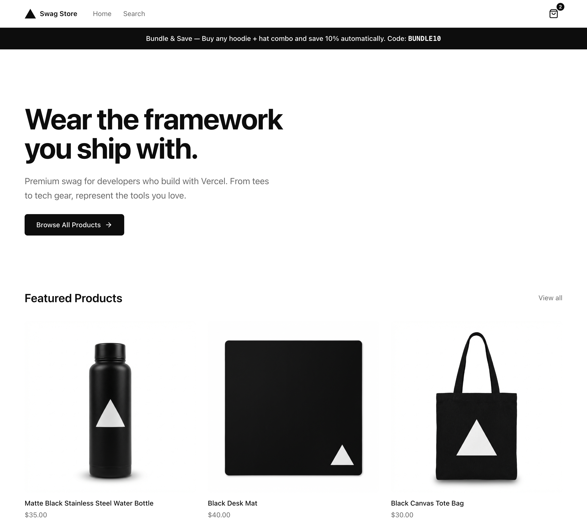

# Vercel Partner Certification — Assignment: Vercel Swag Store

Take-Home Assignment

# Assignment: Vercel Swag Store

Build a storefront using Next.js 16 to demonstrate your understanding of modern React Server Component patterns, including the `"use cache"` directive, Suspense boundaries, Server Actions, and the distinction between static and dynamic data.

## Welcome

Welcome to the Vercel Partner Certification program! We're excited to have you as part of a select group of candidates working toward certification. As part of this program, you will complete the [Next.js Foundations](https://vercel.com/academy/nextjs-foundations) course through Vercel Academy, which will teach you the fundamental best practices of building with Next.js and shipping on Vercel. The [Next.js Learn](https://nextjs.org/learn) course is also a great companion resource as you build out your project.

We strongly encourage you to read through the entire assignment requirements below before starting the Foundations course. This way, you can apply what you're learning directly to the application you'll be building — and hit the ground running.

## Use of AI Coding Tools

You are welcome to consult AI coding assistants as a reference during this assignment — for example, to help generate a design or explore ideas. However, you are expected to write the code yourself. You must be able to fully explain your architecture decisions, implementation details, and how your solution adheres to Next.js 16 and Vercel best practices. Submissions that appear to be primarily AI-generated without demonstrated understanding may not pass the certification review.

## Overview

You will create a fictional "Vercel Swag Store" consisting of three pages and cart functionality:

### Homepage

`/`

A marketing landing page with featured products and a dynamic promotional banner.

### Product Detail

`/products/[param]`

A dynamic route displaying individual product information with real-time stock availability.

### Search

`/search`

A searchable product listing that performs server-side filtering with URL persistence.

### Cart

`Session-based`

Full cart functionality with add, update, remove, and session persistence.

**Note on design:** You are free to make your own design choices regarding colors, typography, and visual styling. The focus of this assignment is on correct implementation of Next.js 16 features, not pixel-perfect design. However, your application should be polished, mobile-friendly, and provide a good user experience.

Example design for reference:

## General Site Requirements

| Component              | Specification                                                                             |
| ---------------------- | ----------------------------------------------------------------------------------------- |
| Header                 | Persistent header containing a logo and navigation links to the Homepage and Search page. |
| Footer                 | Footer containing copyright text and year.                                                |
| Layout                 | Shared root layout that renders the header and footer on all pages.                       |
| Responsive Design      | The application must be mobile-friendly and work well across different viewport sizes.    |
| Root Metadata          | Define default metadata in the root layout that applies to all pages.                     |
| Page-Specific Metadata | Each page should export its own metadata that overrides or extends the root metadata.     |
| Open Graph             | Include Open Graph metadata (openGraph) for social sharing.                               |
| Cache Components       | Cache Components are enabled.                                                             |

## Page 1: Homepage

Route: /

| Component          | Specification                                                                                                                                          |
| ------------------ | ------------------------------------------------------------------------------------------------------------------------------------------------------ |
| Hero Section       | A prominent hero area with headline text, supporting description, a call-to-action button, and a visual element (image or illustration).               |
| Promotional Banner | A banner displaying the current sale or promotion, fetched from the provided API.                                                                      |
| Featured Products  | A grid displaying at least 6 products fetched from the provided API. Each product should show its image, name, and price, and link to its detail page. |

## Page 2: Product Detail Page

Route: /products/\[param\]

| Component           | Specification                                                                                                                                      |
| ------------------- | -------------------------------------------------------------------------------------------------------------------------------------------------- |
| Product Image       | A large product image.                                                                                                                             |
| Product Information | The product name, price (formatted as currency), and description.                                                                                  |
| Stock Indicator     | Display of current stock availability fetched from the provided API.                                                                               |
| Quantity Selector   | Input allowing the user to select a quantity, respecting stock limits.                                                                             |
| Add to Cart Button  | A button with text "Add to Cart" that is disabled when the product is out of stock. (Functional cart logic is not required for this button alone.) |

## Cart Functionality

| Component           | Specification                                                                                                                                                                                                            |
| ------------------- | ------------------------------------------------------------------------------------------------------------------------------------------------------------------------------------------------------------------------ |
| Add to Cart         | Users can add products to the cart from the Product Detail page using the Add to Cart button. Authentication is not required.                                                                                            |
| Cart Indicator      | The header displays a cart icon with a badge showing the current number of items in the cart.                                                                                                                            |
| View Cart           | Users can view the contents of their cart.                                                                                                                                                                               |
| Cart Item Display   | Each item in the cart displays the product name, image, price, quantity, and line item total.                                                                                                                            |
| Quantity Adjustment | Users can increase or decrease the quantity of items in the cart.                                                                                                                                                        |
| Remove Item         | Users can remove items from the cart entirely.                                                                                                                                                                           |
| Cart Total          | The cart displays a subtotal of all items.                                                                                                                                                                               |
| Session Persistence | The cart persists within the same browser session. If the user refreshes the page or navigates away and returns, their cart contents should still be present. Cross-device or cross-browser persistence is not required. |

## Page 3: Search Page

Route: /search

| Component               | Specification                                                                                                                           |
| ----------------------- | --------------------------------------------------------------------------------------------------------------------------------------- |
| Search Input            | A text input field for entering search queries.                                                                                         |
| Search Behavior         | Searches can be triggered by pressing Enter, clicking a search button, or automatically after the user has typed at least 3 characters. |
| Default State           | When no search has been performed, display a default set of products.                                                                   |
| Search Results          | When a search is performed, display up to 5 matching products in a responsive grid layout.                                              |
| Category Filter         | A dropdown or select input allowing users to filter products by category.                                                               |
| Empty State             | When a search returns no results, display an appropriate message.                                                                       |
| Loading State           | Visual feedback while a search is being performed.                                                                                      |
| Persistent Search State | If the user refreshes the page or shares the URL, the same search results should appear.                                                |

## API Reference

Full API documentation is available via the interactive Scalar docs below. The documentation includes all available endpoints, request and response schemas, and example payloads.

### API Documentation

The API docs are password-protected. Use the credentials below to access them.

[Open API Documentation](api-1.json)

## Deliverables

When your project is complete, please submit the following:

1.  Public GitHub Repository — A link to the public repository containing your source code. Ensure the repository is accessible so it can be reviewed.
2.  Deployed Application — A public Vercel deployment URL (\*.vercel.app) where your application can be accessed and tested.

Email both links to [alex.hawley@vercel.com](mailto:alex.hawley@vercel.com), [joey.malysz@vercel.com](mailto:joey.malysz@vercel.com) and [partner.program@vercel.com](mailto:partner.program@vercel.com) once you are ready for review.
